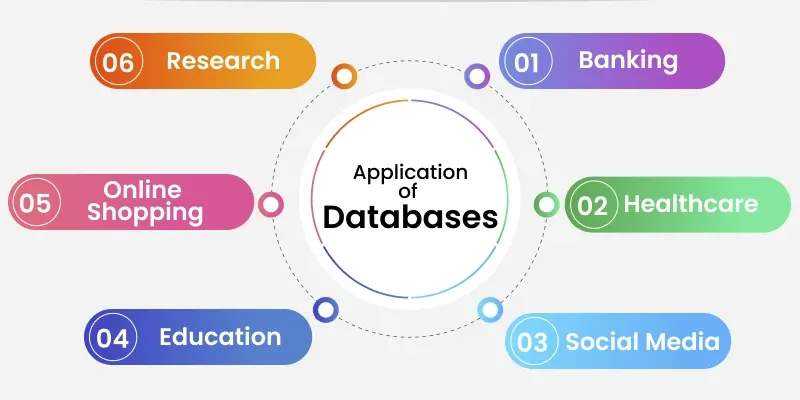
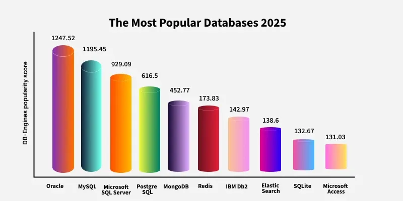
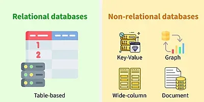

# Giới thiệu về Cơ sở dữ liệu

**Cập nhật lần cuối:** 28/04/2026

---

## 1. Mục tiêu bài giảng

Sau khi hoàn thành bài học này, người học có thể:

1. Giải thích được khái niệm **dữ liệu** và **cơ sở dữ liệu**.
2. Trình bày được vai trò của **hệ quản trị cơ sở dữ liệu** trong việc lưu trữ, truy xuất và quản lý dữ liệu.
3. Mô tả được các thành phần chính của một cơ sở dữ liệu.
4. Phân biệt được hai nhóm cơ sở dữ liệu phổ biến: **Relational Database** và **NoSQL Database**.
5. Giải thích được ý nghĩa của các tính chất **ACID** trong giao dịch cơ sở dữ liệu.
6. Nhận diện được các ứng dụng thực tế của cơ sở dữ liệu trong nhiều lĩnh vực.
7. Lựa chọn được loại cơ sở dữ liệu phù hợp với một số miền công nghệ như Web, Mobile, DevOps, Data Engineering, Data Science, AI, Cloud và Blockchain/Web3.

---

## 2. Khái niệm dữ liệu và cơ sở dữ liệu

**Dữ liệu** (*data*) là các sự kiện, con số hoặc thông tin thô, chưa được tổ chức và chưa có nhiều ý nghĩa nếu đứng riêng lẻ.

Ví dụ:

- Tên khách hàng.
- Số điện thoại.
- Mã sinh viên.
- Điểm thi.
- Ngày giao dịch.
- Ảnh, video, âm thanh.
- Dữ liệu cảm biến.

Khi dữ liệu được xử lý, sắp xếp và phân tích, nó có thể tạo ra **thông tin có ý nghĩa** phục vụ cho việc ra quyết định.

**Cơ sở dữ liệu** (*database*) là một hệ thống có cấu trúc dùng để **lưu trữ**, **quản lý**, **truy xuất** và **cập nhật** dữ liệu một cách hiệu quả cho nhiều người dùng và nhiều ứng dụng khác nhau.

Cơ sở dữ liệu quan trọng vì các đặc điểm sau:

1. **Khả năng mở rộng**

   Cơ sở dữ liệu có thể xử lý khối lượng dữ liệu lớn một cách hiệu quả.

2. **Tính toàn vẹn dữ liệu**

   Cơ sở dữ liệu duy trì độ chính xác của dữ liệu thông qua các quy tắc, ràng buộc và kiểm soát hợp lệ.

3. **Bảo mật**

   Cơ sở dữ liệu bảo vệ dữ liệu thông qua quyền truy cập, phân quyền người dùng và các cơ chế kiểm soát bảo mật.

4. **Phân tích dữ liệu**

   Cơ sở dữ liệu giúp lưu trữ và tổ chức dữ liệu để phục vụ phân tích, từ đó hỗ trợ ra quyết định tốt hơn.

---

### Quiz nhanh: Khái niệm dữ liệu và cơ sở dữ liệu

**Câu 1.** Dữ liệu là gì?

A. Thông tin đã được phân tích hoàn chỉnh  
B. Các sự kiện, con số hoặc thông tin thô chưa được xử lý  
C. Một phần mềm quản lý dữ liệu  
D. Một dạng ngôn ngữ lập trình  

**Câu 2.** Cơ sở dữ liệu được dùng chủ yếu để làm gì?

A. Thiết kế giao diện người dùng  
B. Lưu trữ, quản lý và truy xuất dữ liệu  
C. Chỉ để viết chương trình Python  
D. Chỉ để lưu ảnh  

**Câu 3.** Đặc điểm nào giúp cơ sở dữ liệu xử lý khối lượng dữ liệu lớn?

A. Security  
B. Scalability  
C. Isolation  
D. Durability  

---

## 3. Cách cơ sở dữ liệu hoạt động

Cơ sở dữ liệu hoạt động bằng cách tổ chức và lưu trữ thông tin theo một định dạng có cấu trúc hoặc phi cấu trúc, cho phép người dùng dễ dàng:

- Truy cập dữ liệu.
- Tìm kiếm dữ liệu.
- Truy xuất dữ liệu.
- Cập nhật dữ liệu.
- Xóa dữ liệu.
- Quản lý quyền truy cập.

Ở trung tâm của hầu hết các hệ thống cơ sở dữ liệu là **hệ quản trị cơ sở dữ liệu** (*Database Management System - DBMS*).

DBMS là lớp phần mềm trung gian giữa người dùng và dữ liệu thô. Người dùng không cần biết chi tiết vật lý về nơi dữ liệu được lưu trữ trên ổ đĩa, cách hệ thống tổ chức tệp hay cách truy xuất từng khối dữ liệu. Thay vào đó, họ tương tác với DBMS thông qua câu lệnh truy vấn hoặc ứng dụng.

Quy trình hoạt động cơ bản như sau:

1. Người dùng hoặc ứng dụng gửi một yêu cầu đến DBMS.

   Ví dụ: tìm kiếm khách hàng, cập nhật điểm sinh viên, thêm đơn hàng mới.

2. DBMS tiếp nhận và xử lý yêu cầu.

   DBMS kiểm tra cú pháp truy vấn, kiểm tra quyền truy cập, tối ưu hóa truy vấn và xác định dữ liệu cần lấy hoặc thay đổi.

3. DBMS truy cập dữ liệu liên quan.

   Dữ liệu có thể được lấy từ bảng, chỉ mục, tệp lưu trữ hoặc các cấu trúc dữ liệu nội bộ khác.

4. DBMS trả kết quả về cho người dùng hoặc ứng dụng.

   Kết quả thường được trả về dưới dạng bảng, bản ghi, tài liệu hoặc đối tượng tùy loại cơ sở dữ liệu.

Ngoài các thao tác truy vấn và cập nhật, DBMS còn cung cấp nhiều chức năng quan trọng:

- Sao lưu dữ liệu.
- Khôi phục dữ liệu khi có lỗi.
- Tối ưu hiệu năng.
- Quản lý giao dịch.
- Kiểm soát truy cập.
- Đảm bảo an toàn dữ liệu.
- Quản lý đồng thời khi nhiều người dùng cùng truy cập.

---

### Quiz nhanh: Cách cơ sở dữ liệu hoạt động

**Câu 1.** DBMS đóng vai trò gì trong hệ thống cơ sở dữ liệu?

A. Là lớp trung gian giữa người dùng và dữ liệu  
B. Là thiết bị phần cứng dùng để lưu trữ dữ liệu  
C. Là ngôn ngữ lập trình thay thế SQL  
D. Là phần mềm chỉ dùng để vẽ biểu đồ  

**Câu 2.** Khi người dùng gửi truy vấn, DBMS thường làm gì?

A. Bỏ qua truy vấn  
B. Xử lý truy vấn, tìm dữ liệu phù hợp và trả kết quả  
C. Luôn xóa dữ liệu trước khi trả kết quả  
D. Chỉ lưu truy vấn vào tệp văn bản  

**Câu 3.** Chức năng nào sau đây là chức năng quan trọng của DBMS?

A. Sao lưu và khôi phục dữ liệu  
B. Chỉ phát nhạc  
C. Chỉ chỉnh sửa ảnh  
D. Chỉ biên dịch chương trình C++  

---

## 4. Các thành phần của một cơ sở dữ liệu

Một cơ sở dữ liệu bao gồm nhiều thành phần phối hợp với nhau để lưu trữ, tổ chức, quản lý và truy xuất dữ liệu hiệu quả.

