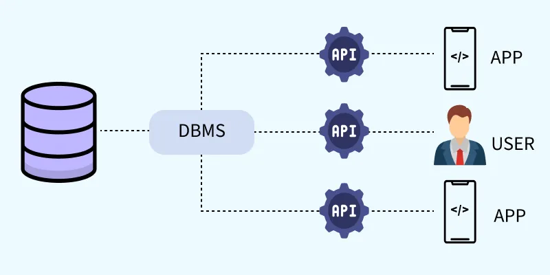
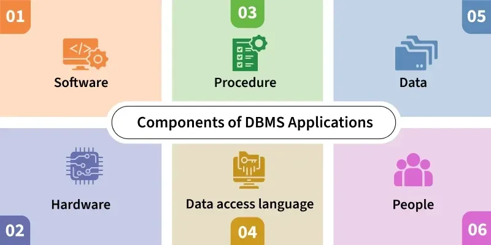
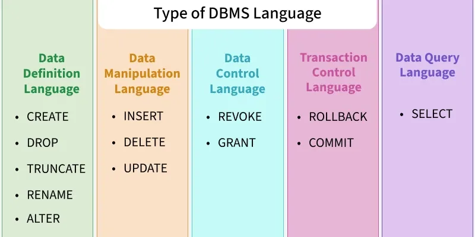
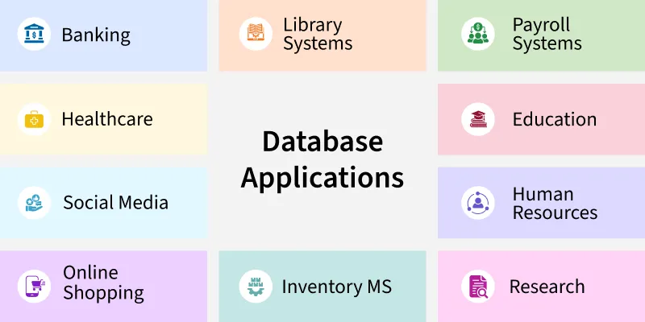

# Giới thiệu về DBMS

## Mở đầu
DBMS (Database Management System) là hệ thống phần mềm dùng để quản lý, lưu trữ và truy xuất dữ liệu một cách hiệu quả trong cấu trúc có tổ chức. DBMS đóng vai trò cầu nối giữa cơ sở dữ liệu trung tâm với nhiều ứng dụng và người dùng.

## Learning Objectives
Sau bài học này, người học có thể:
- Giải thích khái niệm DBMS và vai trò của nó trong hệ thống thông tin.
- Phân tích các vấn đề của mô hình lưu trữ dựa trên file truyền thống.
- Mô tả các thành phần chính của một ứng dụng DBMS.
- Phân biệt các kiểu DBMS phổ biến và nêu ví dụ điển hình.
- Nhận biết các nhóm ngôn ngữ cơ sở dữ liệu và chức năng của chúng.
- Liên hệ ứng dụng của DBMS trong các lĩnh vực thực tế.

## Learning Outcomes (CLO)
| CLO | Outcome | Cognitive level | Evidence or assessment |
|---|---|---|---|
| CLO1 | Trình bày được định nghĩa và vai trò của DBMS | Nhớ hiểu | Trả lời câu hỏi ngắn về khái niệm DBMS |
| CLO2 | Giải thích được các hạn chế của hệ thống file truyền thống | Hiểu phân tích | So sánh file system và DBMS |
| CLO3 | Mô tả được 6 thành phần của ứng dụng DBMS | Hiểu | Vẽ sơ đồ hoặc liệt kê đúng thành phần |
| CLO4 | Phân biệt được các loại DBMS phổ biến | Phân tích | Ghép đúng loại DBMS với đặc điểm và ví dụ |
| CLO5 | Nhận diện được các nhóm ngôn ngữ DBMS | Nhớ hiểu | Chọn đúng lệnh thuộc DDL, DML, DCL, TCL, DQL |

## Nội dung chính

## Giới thiệu chi tiết về DBMS

Cập nhật: 14 Tháng 5, 2026

DBMS (Hệ quản trị cơ sở dữ liệu) là hệ thống phần mềm quản lý, lưu trữ và truy xuất dữ liệu một cách hiệu quả theo một cấu trúc có tổ chức. DBMS hoạt động như một cầu nối giữa cơ sở dữ liệu trung tâm và nhiều khách (ứng dụng và người dùng).

- DBMS kết nối cơ sở dữ liệu trung tâm với nhiều khách hàng (ứng dụng và người dùng).
- Cho phép người dùng tạo, cập nhật và truy vấn dữ liệu một cách hiệu quả.
- Đảm bảo tính toàn vẹn, nhất quán và bảo mật dữ liệu khi nhiều người cùng truy cập.
- Giảm dư thừa và bất nhất dữ liệu thông qua quản lý tập trung.
- Hỗ trợ truy cập đồng thời, quản lý giao dịch và sao lưu tự động.
- Sử dụng API để xử lý yêu cầu dữ liệu, đảm bảo truy cập an toàn và hiệu quả.

	

<em>Tổng quan về DBMS</em>

## Vấn đề của hệ thống lưu trữ dựa trên file truyền thống

Trước khi DBMS phổ biến, dữ liệu thường được quản lý bằng các hệ thống file cơ bản trên ổ đĩa. Mặc dù phương pháp này cho phép lưu, truy xuất và cập nhật file cần thiết, nó gặp nhiều hạn chế:

- **Dư thừa dữ liệu:** cùng một thông tin bị lưu lặp ở nhiều file.
- **Bất nhất:** thông tin có thể mâu thuẫn hoặc lỗi thời giữa các file.
- **Khó truy cập:** phải tìm thủ công trong nhiều file.
- **Bảo mật kém:** không có cơ chế kiểm soát truy cập chặt chẽ.
- **Không hỗ trợ đa người dùng:** khó phối hợp nhiều người truy cập đồng thời.
- **Không có cơ chế sao lưu/khôi phục mạnh:** mất dữ liệu thường khó phục hồi.

Ví dụ: trong một trường đại học, nếu dữ liệu học vụ, kết quả và ký túc xá được lưu riêng rẽ theo các file khác nhau, việc đồng bộ và duy trì tính nhất quán sẽ rất khó khăn.

## Các thành phần của ứng dụng DBMS

Mọi ứng dụng dựa trên DBMS thường bao gồm sáu thành phần chính hợp tác để quản lý dữ liệu hiệu quả.

	

### 1. Phần cứng (Hardware)

- Các thiết bị vật lý như máy chủ, ổ đĩa, bộ nhớ, thiết bị nhập/xuất (bàn phím, màn hình, máy in).
- Lưu trữ và xử lý dữ liệu; kết nối dữ liệu thực thế với hệ thống số.
- Ví dụ: ổ cứng máy chủ, RAM, thiết bị mạng.

### 2. Phần mềm (Software)

- Phần mềm DBMS như MySQL, Oracle, PostgreSQL.
- Bao gồm lõi cơ sở dữ liệu, hệ điều hành, phần mềm mạng và công cụ ứng dụng.
- Chuyển đổi các lệnh truy cập dữ liệu thành các thao tác trên hệ thống.

### 3. Dữ liệu (Data)

- Các sự kiện thô được lưu ở dạng có cấu trúc hoặc không có cấu trúc.
- Dữ liệu vận hành: dữ liệu thực tế của người dùng (ví dụ: tên, tuổi).
- Metadata: dữ liệu mô tả dữ liệu (ví dụ: kiểu dữ liệu, kích thước, thời gian lưu).

### 4. Quy trình (Procedures)

- Các hướng dẫn và quy tắc sử dụng DBMS: cấu hình, đăng nhập/đăng xuất, xác thực, sao lưu, kiểm tra dữ liệu và tạo báo cáo.
- Đảm bảo việc sử dụng hệ thống nhất quán và an toàn.

### 5. Ngôn ngữ truy cập cơ sở dữ liệu (Database Access Language)

- Dùng để tương tác với cơ sở dữ liệu (tạo, đọc, cập nhật, xóa dữ liệu).
- Ví dụ: SQL, PL/SQL.
- DDL (Data Definition Language) – `CREATE`, `ALTER`, `DROP`
- DML (Data Manipulation Language) – `INSERT`, `UPDATE`, `DELETE`

### 6. Con người (People)

- Những người tương tác với DBMS ở nhiều vai trò khác nhau:
	- Quản trị cơ sở dữ liệu (DBA) – quản lý bảo mật, hiệu năng, quyền truy cập.
	- Lập trình viên – phát triển ứng dụng kết nối với CSDL.
	- Người dùng cuối – sử dụng ứng dụng để truy cập dữ liệu (ví dụ: sinh viên, nhân viên).

## Các loại DBMS

Có nhiều loại hệ quản trị cơ sở dữ liệu, phù hợp với các cấu trúc dữ liệu và yêu cầu mở rộng khác nhau. Các loại phổ biến gồm:

### 1. RDBMS (Relational DBMS)

- Tổ chức dữ liệu thành các bảng (relation) gồm các hàng và cột.
- Sử dụng khóa chính để định danh hàng và khóa ngoại để liên kết bảng.
- Truy vấn bằng SQL cho phép thao tác và truy xuất hiệu quả.
- Ví dụ: MySQL, Oracle, Microsoft SQL Server, PostgreSQL.

### 2. NoSQL

- Thiết kế để xử lý dữ liệu quy mô lớn và yêu cầu hiệu năng cao.
- Lưu trữ ở dạng key-value, document, graph hoặc column.
- Mô hình linh hoạt, thuận tiện khi dữ liệu không theo cấu trúc quan hệ chặt.
- Ví dụ: MongoDB, Cassandra, DynamoDB, Redis.

### 3. OODBMS (Object-Oriented DBMS)

- Kết hợp khái niệm hướng đối tượng vào cơ sở dữ liệu, lưu dữ liệu dưới dạng đối tượng.
- Hỗ trợ kiểu dữ liệu phức tạp và quan hệ, phù hợp cho mô phỏng thực tế.
- Ví dụ: ObjectDB, db4o.

### 4. Cơ sở dữ liệu phân cấp (Hierarchical)

- Tổ chức dữ liệu theo cấu trúc cây, mỗi nút có một cha và có thể có nhiều con.
- Phù hợp cho dữ liệu có cấu trúc phân cấp rõ ràng nhưng kém linh hoạt cho quan hệ phức tạp.
- Ví dụ: IBM IMS.

### 5. Mạng (Network Database)

- Mô hình dạng đồ thị cho phép quan hệ phức tạp hơn, con có thể có nhiều cha (many-to-many).
- Dữ liệu được biểu diễn bằng record và set, set xác định quan hệ.
- Ví dụ: IDS, TurboIMAGE.

### 6. Cơ sở dữ liệu đám mây (Cloud-Based)

- Triển khai trên nền tảng đám mây như AWS, Azure, Google Cloud.
- Hỗ trợ mở rộng theo nhu cầu, tính sẵn sàng cao, sao lưu tự động và truy cập từ xa.
- Có thể là SQL hoặc NoSQL, do nhà cung cấp dịch vụ quản lý hạ tầng.
- Ví dụ: Amazon RDS, MongoDB Atlas, Google BigQuery.

## Ngôn ngữ cơ sở dữ liệu

Ngôn ngữ cơ sở dữ liệu gồm các lệnh để định nghĩa, thao tác và kiểm soát dữ liệu. Các nhóm chính:

	

### 1. DDL (Data Definition Language)

- Quản lý cấu trúc dữ liệu và sơ đồ cơ sở dữ liệu.
- `CREATE`, `ALTER`, `DROP`, `TRUNCATE`, `COMMENT`, `RENAME`.

### 2. DML (Data Manipulation Language)

- Thao tác dữ liệu: `INSERT`, `UPDATE`, `DELETE`, `MERGE`, `CALL`, `EXPLAIN PLAN`, `LOCK TABLE`.

### 3. DCL (Data Control Language)

- Quản lý quyền truy cập: `GRANT`, `REVOKE`.

### 4. TCL (Transaction Control Language)

- Quản lý giao dịch: `ROLLBACK`, `COMMIT`, `SAVEPOINT`.

### 5. DQL (Data Query Language)

- Truy vấn dữ liệu mà không sửa: `SELECT` là lệnh chính.

## Ứng dụng của DBMS

	

- **Ngân hàng:** quản lý tài khoản và giao dịch.
- **Thương mại điện tử:** theo dõi sản phẩm, đơn hàng và khách hàng.
- **Y tế:** lưu hồ sơ bệnh nhân và chẩn đoán.
- **Giáo dục:** quản lý điểm số và thời khóa biểu.
- **Mạng xã hội:** quản lý hồ sơ người dùng và tương tác.
- **Khoa học dữ liệu:** hỗ trợ phân tích và dự báo.

2. Ví dụ nào sau đây là ứng dụng DBMS trong giáo dục?
- A. Quản lý điểm số và thời khóa biểu
- B. Tạo hiệu ứng ảnh động
- C. Soạn văn bản không lưu trữ dữ liệu
- D. Nén tệp video

## Summary
DBMS là nền tảng quan trọng để quản lý dữ liệu tập trung, an toàn và hiệu quả. So với hệ thống file truyền thống, DBMS giải quyết tốt hơn các vấn đề dư thừa, bất nhất, bảo mật, chia sẻ đồng thời và sao lưu. Ngoài khái niệm cơ bản, người học cần nắm 6 thành phần của một ứng dụng DBMS, các kiểu DBMS phổ biến, nhóm ngôn ngữ cơ sở dữ liệu và các lĩnh vực ứng dụng thực tế.

## Key Terms
| Thuật ngữ | Giải thích ngắn |
|---|---|
| DBMS | Hệ thống quản lý cơ sở dữ liệu |
| RDBMS | DBMS quan hệ, dữ liệu lưu trong bảng |
| NoSQL | DBMS phi quan hệ, linh hoạt cho dữ liệu lớn |
| OODBMS | DBMS hướng đối tượng |
| DDL | Ngôn ngữ định nghĩa dữ liệu |
| DML | Ngôn ngữ thao tác dữ liệu |
| DCL | Ngôn ngữ điều khiển dữ liệu |
| TCL | Ngôn ngữ điều khiển giao dịch |
| DQL | Ngôn ngữ truy vấn dữ liệu |
| Metadata | Dữ liệu mô tả dữ liệu |
| DBA | Người quản trị cơ sở dữ liệu |

## Quiz
### Câu 1
DBMS là gì?
- A. Một trình soạn thảo văn bản
- B. Một hệ thống quản lý cơ sở dữ liệu
- C. Một ngôn ngữ lập trình
- D. Một phần mềm đồ họa

### Câu 2
Vấn đề nào sau đây là hạn chế điển hình của hệ thống file truyền thống?
- A. Dễ mở rộng tự động
- B. Dữ liệu không bao giờ bị lặp
- C. Dư thừa và bất nhất dữ liệu
- D. Có sao lưu tự động mạnh

### Câu 3
Thành phần nào sau đây là một phần của ứng dụng DBMS?
- A. Hardware
- B. Color palette
- C. Sound mixer
- D. Browser theme

### Câu 4
RDBMS lưu dữ liệu chủ yếu dưới dạng nào?
- A. Cây phân cấp
- B. Đồ thị mạng
- C. Bảng gồm hàng và cột
- D. Tệp âm thanh

### Câu 5
Lệnh nào thuộc DDL?
- A. SELECT
- B. INSERT
- C. CREATE
- D. COMMIT

### Câu 6
Lệnh nào dùng để cấp quyền truy cập?
- A. REVOKE
- B. GRANT
- C. ROLLBACK
- D. ALTER

### Câu 7
Lệnh nào dùng để truy vấn dữ liệu mà không sửa dữ liệu gốc?
- A. DROP
- B. SELECT
- C. UPDATE
- D. TRUNCATE

### Câu 8
DBMS được ứng dụng mạnh trong lĩnh vực nào sau đây?
- A. Ngân hàng
- B. Chỉ vẽ minh họa
- C. Chỉ chơi game offline
- D. Chỉ xử lý ảnh cá nhân

## Exercises
1. Viết lại bằng lời của bạn sự khác nhau giữa hệ thống file truyền thống và DBMS.
2. Lập bảng so sánh RDBMS, NoSQL và hierarchical database theo cấu trúc dữ liệu và ví dụ.
3. Cho một tình huống trong trường đại học, hãy chỉ ra 6 thành phần của hệ thống DBMS tương ứng.
4. Phân loại các lệnh `CREATE`, `INSERT`, `GRANT`, `COMMIT`, `SELECT` vào đúng nhóm ngôn ngữ.
5. Chọn một lĩnh vực ứng dụng DBMS và mô tả lợi ích của DBMS trong lĩnh vực đó.

## Answer Key - Section Quizzes
1. B
2. C
3. A
4. B
5. B
6. B
7. C
8. B
9. C
10. C
11. A
12. A

## Answer Key
1. B
2. C
3. A
4. C
5. C
6. B
7. B
8. A
